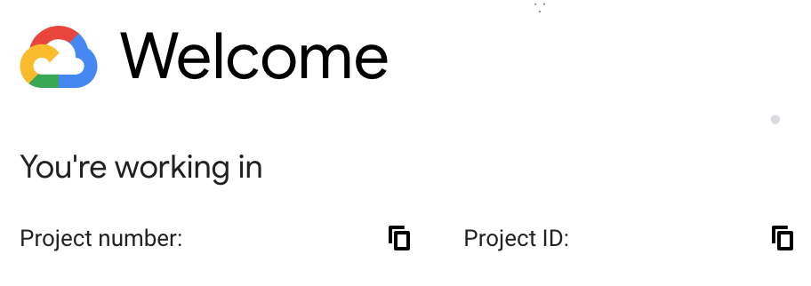

## Abstract

Google Cloud offer developers thousands of free and public machine images. They include famous Linux distributions like CentOS, Ubuntu, Debian, ... being built for both regular usages and specialized usages.

In many cases, developers want to create their own images, either for daily usage or business requirements.

There are many guides on setting up Cloud Build for image building. However, none of them point out common mistakes that can cause hours of logs tracing and retrying till you can get it works.

Thus, this tutorial will help you setup the above workflow and avoid common mistakes.

## Introduction

### Google Cloud Platform

GCP is one of the largest cloud platforms in the world, it has wide cloud computing, storage and networking.

If you are a new user, Google Cloud give you `$300` credit for 1 year free trial.

Furthermore, Cloud Build service offer free `120 minutes/day` of machine type `n1-standard-1`.

### Packer by HashiCorp

Packer is a free tool which use your cloud compute engine to create custom machine image. It has wide supports for Google Cloud Platform, Amazon Web Service, Azure and many more.

## Requirements

Make sure you meet these terms:

- A billing enabled google project
- A Git repo contains your source code
- Install the [gcloud CLI](https://cloud.google.com/sdk/docs/install) or knew how to [Launch Cloud Shell](https://cloud.google.com/shell/docs/launching-cloud-shell)

## Steps

### Enable required APIs

1. Browse to [Google Cloud Console](https://console.cloud.google.com/).

2. Obtains `project-id`



2. From `Navigation Menu` -> `APIs & Services` -> `Enabled APIs & Services`.

3. Click button `ENABLE APIS AND SERVICES`.

4. Search for these APIs and enable all of them:

- Cloud Build API
- Compute Engine API
- Service Management API
- Google Cloud Storage JSON API

### Grant IAM permissions for Cloud Build principal

1. From the `Navigation Menu` -> `IAM & Admin` -> `IAM`.

2. Edit the existed principal `<random-number>@cloudbuild.gserviceaccount.com`

3. Add these roles:

- Cloud Build Service Account (already added by default)
- Compute Admin
- Service Account User

### Add `packer` to your `gcr.io`

1. Clone packer

```bash
git clone https://github.com/GoogleCloudPlatform/cloud-builders-community.git
```

2. Cd into packer

```bash
cd cloud-builders-community/packer
```

3. Build and publish to `gcr.io`

```bash
gcloud builds submit .
```

Wait a few second and press `y` when prompt

### Add packer configs to your source code

At root of your repo, add these files:

#### **`cloudbuild.yaml`**

```yaml
steps:
  - name: "gcr.io/<your-project-id>/packer"
    args:
      - build
      - packer.json
```

#### **`packer.json`**

```json
{
  "builders": [
    {
      "type": "googlecompute",
      "project_id": "<your-project-id>",
      "zone": "us-central1-a",
      "image_storage_locations": ["us-central1"],
      "ssh_username": "packer",
      "source_image_family": "debian-11",
    }
  ],
  "provisioners": [
    {
      "type": "shell",
      "inline": "echo 'Hello World!'"
    }
  ]
}
```

### Setup Cloud Build Trigger

1. From the `Navigation Menu` -> `Cloud Build` -> `Triggers`.

2. Click button `+ Create Trigger`.

3. Input these values:

- Name: `<your-trigger-name>`
- Event: `Push to a branch`
- Source: Connect to your Git repository
- Configuration: `Cloud Build configuration file (yaml or json)`
- Location: `Repository`
- Cloud Build configuration file location: `cloudbuild.yaml`
- Service account: Leave empty

4. Click button `Create`

### Run Trigger

Click button `RUN` from triggers list. When the snackbar appear, click `Show` to trace realtime logs.

## Results

From the `Navigation Menu` -> `Compute Engine` -> `STORAGE` -> `Images`

An image is created with name `packer-<timestampe>`

## References

- [Building VM images using Packer](https://cloud.google.com/build/docs/building/build-vm-images-with-packer)
- [Google Compute Builder](https://www.packer.io/plugins/builders/googlecompute)
- [Community-contributed images for Google Cloud Build](https://github.com/GoogleCloudPlatform/cloud-builders-community)